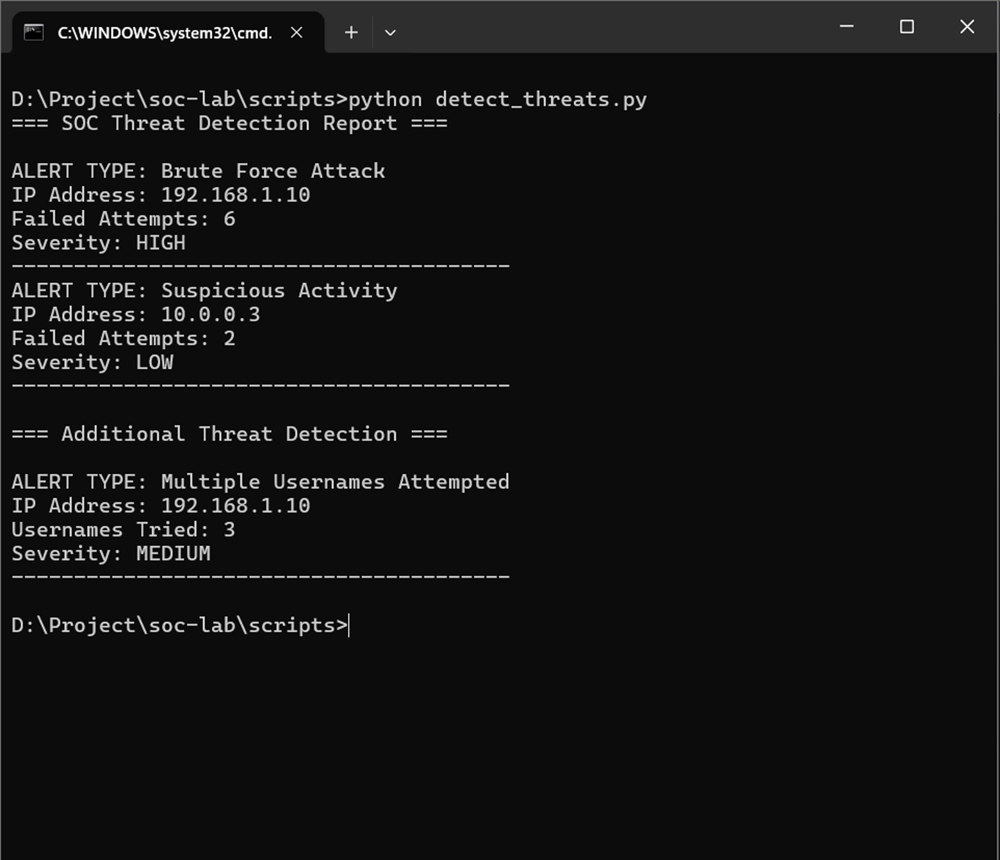

# SOC Log Analysis & Threat Detection Lab

> A beginner-friendly SOC lab demonstrating log analysis and threat detection using Python.

## Overview

This project simulates a Security Operations Center (SOC) environment by analyzing authentication logs to detect potential security threats such as brute-force attacks and suspicious login behavior.

## Real-World Relevance

This project reflects core SOC Analyst responsibilities such as log monitoring, threat detection, and identifying brute-force attacks. These are common incidents handled in real-world SOC environments.

## Objectives

* Analyze authentication logs
* Detect brute-force attack patterns
* Identify suspicious multi-user login attempts
* Classify threat severity levels

## Technologies Used

* Python
* CSV (Log Data Simulation)

## Features

* Time-based brute-force detection (within 5-minute window)
* Severity classification (LOW, MEDIUM, HIGH)
* Detection of multiple usernames attempted from a single IP
* Structured alert reporting

## Project Structure

```
soc-log-analysis-lab/
├── logs/
│   └── auth_logs.csv
├── scripts/
│   └── detect_threats.py
├── screenshots/
│   └── output.png
└── README.md
```

## How to Run

1. Navigate to the project directory:

```
cd soc-log-analysis-lab/scripts
```

2. Run the script:

```
python detect_threats.py
```

## Execution Output



This output demonstrates detection of brute-force attacks and suspicious login behavior based on authentication logs.

## Sample Output

```
ALERT TYPE: Brute Force Attack  
IP Address: 192.168.1.10  
Failed Attempts: 6  
Severity: HIGH  

ALERT TYPE: Multiple Usernames Attempted  
IP Address: 192.168.1.10  
Usernames Tried: 3  
Severity: MEDIUM  
```

## Key Learning Outcomes

* Log analysis and monitoring
* Threat detection logic implementation
* Understanding brute-force attack patterns
* SOC-level alert generation

## Skills Demonstrated

* Log Analysis
* Threat Detection
* Incident Monitoring
* SOC Operations (Basic)
* Python Scripting for Security
* Cybersecurity Fundamentals

## Future Improvements

* Real-time log monitoring
* Integration with SIEM tools
* Dashboard visualization
* Automated alert notifications

## License

This project is licensed under the MIT License.
